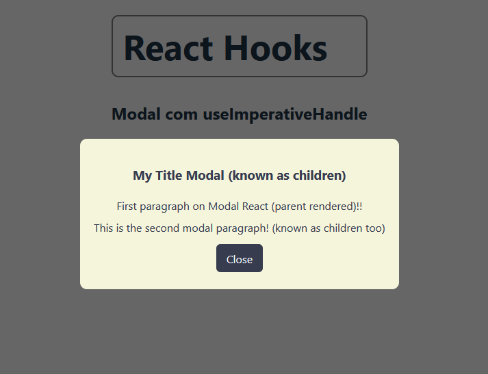
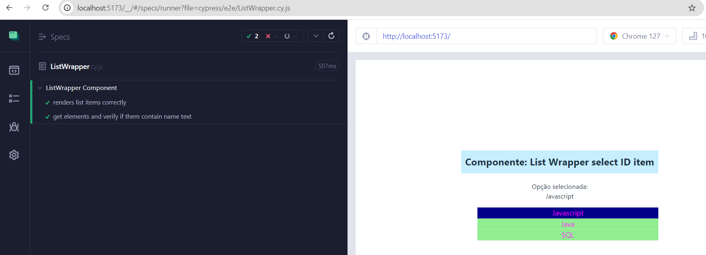

# React

React é uma biblioteca Javascript para desenvolvimento de aplicações SPA(Single Page Application) Front-end que utiliza uma arquitetura baseada em componentes.

O Node.js é uma runtime de Javascript, ou seja, uma biblioteca utilizada por um compilador durante a execução do programa. Construida na V8 engine (escrita em C++ com alta performance) do Google e possibilita criar softwares em JS no lado do servidor.

O npm é um gerenciador de pacotes do Node, que permite baixar bibliotecas de terceiros e executar scripts desenvolvidos na aplicação.

<p align="center">
  
</p>

## 📚 <a id="table-of-contents">Conteúdo</a>

1. **[Introducao](#1-introducao)**
2. **[Fundamentos do React](#2-fundamentos-do-react)**
3. **[Avancando no React](#3-avancando-no-react)**
4. **[CSS no React](#4-css-no-react)**
5. **[Formularios no React](#5-formularios-no-react)**
6. **[Secret Word Game](#6-secret-word-game)**
7. **[Requisicoes HTTP no React](#7-requisicoes-http-no-react)**
8. **[React Router](#8-react-router)**
9. **[Context](#9-context)**


## 1. Introducao

Gerar uma nova aplicação via npx: "npx create-react-app nome-desejado"

Instalação com o Vite: "npm create vite@latest"

Nome do projeto: nome-desejado

Escolher: React e Javascript

Executar a nova aplicação:
```node
  cd nome-desejado
  npm install
  npm run dev
```

- Links:
- [React] (https://react.dev/)

### Desafio 1
1. Entre no arquivo App.js e adicione mais algum elemento HTML da sua escolha;
2. Crie uma regra de estilos em App.css que altere a cor do seu elemento;
3. Vá até o arquivo index.html e altere o título da aplicação na meta tag; 

## 2. Fundamentos do React

JSX é o HTML do React. Onde declaramos as tags HTML que serão exibidas no navegador e ficam no return do componente.
Algumas propriedades mudam no JSX como o class no HTML, no JSX deve ser utilizado className.

Para fazer comentário no JSX:
```jsx
{ /* Comentários */ }
```

Template expressions é o recurso que permite executar Javascript no JSX e também interpolar variáveis.

Exemplo:
```jsx
{ algumCódigoJS }
```
 

### Desafio 2
1. Crie um componente chamado Challenge;
2. Importe-o em App.js;
3. No componente criado faça a criação de dois valores numéricos;
4. Imprima este valores no componente;
5. Crie também um evento de click que soma estes dois valores e exibe no console;

## 3. Avancando no React

Podemos utilizar os eventos como onClick para acessar uma função. As funções geralmente tem o padrão de nomenclatura handleAlgumaCoisa.

### Desafio 3
1. Crie um projeto para a nova seção;
2. Limpe o arquivo do componente principal;
3. Coloque o título de seção 3;


Hooks são funções do React que permitem por exemplo guardar e alterar o estado de algum dado, o ciclo de vida, entre outros recursos, nos componentes funcionais. Todos os hooks começam com "use", por exemplo useState, e com o hook é possível re-renderizar o componente.

Sintaxe do hook:
```jsx
const [elemento, setElemento] = useState(valorInicial)
```

### Renderizar lista no React:
Evitar o Warning: "Each child in a list should have a unique 'key' prop." Para isso, utilize sempre um identificador único (índice único) como chave de cada elemento da lista. Geralmente o id único vem do BD.
Para uma melhor performance utilize o método map() do primeiro exemplo.

#### Utilizando método array.map()
```jsx
const jokes = [
  {id: 151, joke: "abc asd", rating: 4},
  {id: 158, joke: "hrd asd", rating: 1},
  {id: 155, joke: "lun asd", rating: 5},
  {id: 156, joke: "lok asd", rating: 4},
];

return (
  <ul>
    {
      jokes.map((joke) => (
      <li key={joke.id}>
        {joke.joke} - {joke.rating}.
      </li>
    ))
    }
  </ul>
);
```

```jsx
const myList = ['item1', 'item2', 'item3'];
const myComponentList = myList.map((item, index) => (
  <li key={index}>{item}</li>
));

return (
  <ul>
    {myComponentList}
  </ul>
);
```

### Utilizando método Array.forEach()
```jsx
const myList = ['item1', 'item2', 'item3'];
const myComponentList = [];

myList.forEach((item, index) => {
  myComponentList.push(<li key={index}>{item}</li>);
});

return (
  <ul>
    {myComponentList}
  </ul>
);
```

### Previous state
Exemplo implementando um contador que aumenta com base no estado anterior:
```jsx
  const [count, setCount] = useState(0);
  function handleIncrement() {
    setCount(prevCount => prevCount + 1);
  }
  return (
    <div>
      <button onClick={handleIncrement}>Count: {count}</button>
    </div>
 );
```

### Props
As props são propriedades que permitem passar dados do componente pai para um componente filho (unidirecional).
Exemplo:

App.jsx
```jsx
  function App() {
  const avatar = "https://i.imgur.com/1bX5QH6.jpg";
  const alt = "Test image";
  const user = "Lin";

  return (
    <div>
      <h1>Trabalhando com props:</h1>
      <Profile avatarUrl={avatar} avatarAltText={alt} avatarUser={user} /> 
    </div> 
  );
};
export default App
```

Profile.jsx
```jsx
const Avatar = (props) => {
  const {imageU, altT} = props;

  return (
    <div>
      
    </div>
  );
};

const Profile = (props) => {
  const {avatarUrl, avatarAltText, avatarUser} = props;

  return(
    <div className="profile">
      <Avatar imageU={avatarUrl} altT={avatarAltText} />
      <p>Username: {avatarUser}</p>
    </div>
  )
}
export default Profile;
```

### Destructuring
A desestruturação permite desorganizar valores e propriedades de objetos em variáveis distintas. Ou seja, permite extrair do objeto apenas as dados que preciso.
Observe no exemplo abaixo que não precisamos mais passar o props e recuperar props.brand, props.km, etc.

```jsx
const CarDetails = ({brand, km, color}) => {
  return (
    <div>
      <h2>Detalhes do carro</h2>
      <ul>
        {/* O uso de destructuring facilita a escrita do código e mantemos o mesmo nome da propriedade, utilizando apenas as props necessárias para personalizar e renderizar os componentes */}
        <li>Marca: {brand}</li>
        <li>KM: {km}</li>
        <li>Cor: {color}</li>
      </ul>
      <p>Meu carro é um {brand} {color}.</p>
    </div>
  )
}
```

### React Fragments
Possui a sintaxe de uma tag vazia <> </>. React fragment é utilizado quando desejamos envolver um conteúdo HTML no JSX, mas, sem precisar adicionar mais uma div ou envolver o conteúdo em um elemento (nó) extra no DOM.
Ele irá ganhar o elemento pai que estiver mais externo, resultando numa estrutura mais limpa e eficiente.

Exemplo:
```jsx
function Post() {
  return (
    <>
      <PostTitle />
      <PostBody />
    </>
  );
}
```

### Children prop
É um recurso utilizado quando um componente precisa ter JSX dentro dele. Porém, este JSX vem do componente pai. Então, o componente age como um container, abraçando estes elementos. Children é considerada uma prop do componente.
Exemplo:

App.jsx
```jsx
  <Container>
    <p>E este é o conteúdo do container!</p>
  </Container>
```

Container.jsx
```jsx
const Container = ({ children }) => {  {/* Lembrar de desestruturar children */ }
  return (
    <div>
      <h2>Este é o título do container</h2>
      {children}  {/* Aqui será renderizado o conteúdo */}
    </div>
  )
}
```

### Funções em props
As funções podem ser passadas para as props normalmente. Basta criar a função no componente pai e enviar como prop para o componente filho. No filho ela pode ser ativada por evento por exemplo.
Exemplo:

App.jsx
```jsx
 function showMessage(){
    console.log('Evento do componente pai!');
  }
  return(
    <h1>Função como prop:</h1>
    <ExecuteFunction myPropFunction={showMessage} />
  )
```

ExecuteFunction.jsx
```jsx
const ExecuteFunction = ({ myPropFunction }) => {
  return (
    <div>
      <button onClick={myPropFunction}>Clique aqui para executar a função</button>
    </div>
  )
}
```

### State lift
O state lift ou elevação do state, é quando um estado é movido para o componente pai, para que o estado seja manipulado ou compartilhado com todos os componentes filhos que desejam acessá-lo. Ou seja, quando os componentes filhos precisam compartilhar do mesmo estado, centralizado e propagado na aplicação.

### React Hooks - Extra
Além dos hooks vistos no curso React do Zero a Maestria, esta seção 3 apresenta a prática de outros hooks no React JS.

- **`useState()`**:

- **`useEffect()`**: faz com que determinada ação seja executada apenas uma vez. Isso é interessante pois os componentes estão sempre se re-renderizando, então precisamos ter ações únicas as vezes.
O useEffect ainda possui um array de dependências, que deve conter os dados que ativem a execução da função de forma automática. 
O useEffect estará presente nas requisições assíncronas, como em chamada a API.

- **`useReducer()`**: 

- **`useRef()`**: utilizado para persistir valores entre renderizações, ele pode ser usado para armazenar o valor de uma variável mutável que não provoca uma re-renderização. E também, para acessar um elemento HTML no DOM diretamente.

- **`useImperativeHandle()`**: feito uma janela modal na seção 03 com o uso do hook useImperativeHandle que é utilizado para expor os dados desejados do componente filho no componente pai. Ou seja, customizando a referência que o componente pai poderá acessar dentro do componente filho.

Screenshot - Modal in React  




### Desafio 4
1. Crie um array de objetos compostos de pessoas, com as propriedades de nome, idade e profissão (array com pelo menos 3 itens);
2. Os dados devem ser exibidos em um componente UserDetails, que você deve criar, todas as informações devem ser exibidas;
3. Faça uma renderização condicional que exibe se o usuário pode tirar carteira de habilitação ou não, imprima isso também no componente UserDetails;
4. A informação pode ser exibida num parágrafo (checar se idade >= 18);


**[⬆ Back to Top](#table-of-contents)**

---

## 4. CSS no React

O CSS de componente é utilizado para um componente em específico. Geralmente, é criado um arquivo com o mesmo nome do componente e importado no componente.
Note que o CSS vaza para outros componentes se houver uma regra em colisão.
O React já cria um exemplo com o App.jsx e App.css

#### Inline Style
O inline style do React é igual o do CSS. Por meio do atributo style, conseguimos aplicar regras diferentes em um elemento.
Devemos optar por outras maneiras de CSS, o inline pode dificultar a manutenção ou deixar o código imprevisível em algumas situações.

#### Inline Style Dinâmico
O CSS inline dinâmico aplica estilo baseado em uma condicional.
Vamos inserir no atributo um if ternário.
Dependendo da condição podemos mudar que regras de estilo um elemento recebe.

#### Classes dinâmicas no CSS
Podemos aplicar uma lógica para alterar a classe CSS de um elemento. Também através do if ternário. Esta abordagem é mais interessante do que o CSS inline, pois as classes estarão isoladas no arquivo CSS, resolvendo o problema de organização de código.

#### CSS Modules
É um recurso de CSS scoped, ou seja, é exclusivo do componente. 
Usamos a sintaxe Componente.module.css e precisamos importá-lo no componente.

### Desafio 5
1. Crie um novo projeto chamado challengeCSS;
2. No CSS global zere a margin, padding e coloque uma fonte que vc goste;
3. Crie um componente que exibe detalhes de carros, este componente deve ser estilizado com scoped;
4. Exiba pelo menos 3 carros;
5. Coloque um título em App.jsx para o seu projeto, estilize o título com o App.css;


**[⬆ Back to Top](#table-of-contents)**

---

## 5. Formularios no React
Utilizamos a tag form para trabalhar com formularios no React. 
As labels dos inputs contém o atributo htmlFor, que deve ter o valor do name do input.
Não utilizamos action, pois o processamento será feito de forma assíncrona.

#### Label envolvendo o input
Em React um padrão comum é a tag label envolvendo o input.
Isso faz com que o atributo se torne opcional.
Simplificando nossa estrutura de HTML, sem perder a semântica.

#### Manipulação de valores
Para manipular os valores dos inputs vamos utilizar o hook useState, ou seja, podemos armazenar na variável e utilizar o set para alterar o valor.
Vamos criar uma função para alterar o valor no evento onChange. Deixando nosso código fácil de trabalhar nas próximas etapas: como envio dos dados para o BD e validação.

#### Simplificando a manipulação
Quando temos vários inputs podemos realizar a manipulação de forma mais simples. Basicamente criamos uma função inline no onChange.
Ela vai alterar o valor do state com o método set, da mesma forma que a função isolada.

#### Envio de formulário
Para enviar um form vamos utilizar o evento onSubmit.
Ele chamará uma função, e nesta devemos lembrar de parar a submissão com o preventDefault.
Nesta etapa podemos realizar validações, envio de form para o servidor, reset de form e outras ações.

#### Controlled inputs
Controlled inputs é um recurso que nos permite mais flexibilidade nos forms de React. Precisamos apenas igualar o valor (atributo value) ao state.
Um uso muito comum: formulários de edição, que os dados vem do back-end, conseguiremos preencher o input mais facilmente.

#### Limpando formulários
Com o controller inputs limpar o form será fácil. Basta atribuir um valor de uma string vazia aos states e pronto!
Isso será feito após o envio, em formulários que o usuário precisa preencher novamente.

#### Input de Textarea
O textarea pode ser considerado um input de texto normal. Utilizaremos o value para alterar o state inicial e o evento onChange para modificar o valor do state.

#### Input de Select
O select também será muito semelhante aos outros inputs. Quando temos a alteração de um valor o evento onChange pode captar isso. O value também pode atribuir qual option estará selecionada.


**[⬆ Back to Top](#table-of-contents)**

---

## 6. Secret Word Game

Nesta seção criamos o projeto "Secret Word Game" que é um jogo de adivinhação de palavras em React JS (parecido com o da TV ) para treinar components, hooks, functions, props, destructuring, CSS, etc. No jogo utilizamos os hooks useCallback, useEffect, useRef, useState.

Neste jogo, o jogador clica em iniciar jogo, insere uma letra e verifica se a mesma corresponde a palavra randômica escolhida. Caso o jogador tenha digitado uma letra incorreta, ele terá até 3 tentativas.

### Como rodar a aplicação Secret Word (Jogo de Adivinhação de Palavras em React) ?
**1. Acesse o projeto** https://github.com/cidaluna/react-js-master

**2. Baixe o zip do projeto** Clique no botão verde chamado Code e escolha a opção Download ZIP

**2.1. Clone o projeto React** Ao invés de fazer o download, outra opção é instalar o git na sua máquina e fazer o Git Clone do projeto e seguir do passo 5 em diante.

**3. Instale o Node.JS** Caso não tenha o Node.JS instalado na sua máquina, será necessário a instalação da versão 18+

**4. Extraia o projeto React** Extraia o arquivo baixado no local de sua preferência e copie o endereço do local onde você extraiu

**5. Acesse a subpasta secretword** Pelo prompt de comando em modo administrador, cole o local do projeto e navegue nas subpastas até entrar na pasta secretword

**6. Instale as dependências** Digite npm install e aguarde a instalação das dependências

**7. Execute a aplicação** Em seguida, digite npm run dev

**8. Navegue pelo projeto**  Aguarde o prompt informar o link de acesso para navegar no Jogo Secret Word.

### Screenshot da tela
Imagem da tela atual do Secret Word Game (Jogo de adivinhar a palavra)


**[⬆ Back to Top](#table-of-contents)**

---

## 7. Requisicoes HTTP no React

#### JSON Server
O JSON Server é um pacote npm, ele simula uma API e isso nos possibilita fazer requisições HTTP.
Vamos aprender a integrar este recursi com o React. Podemos entender isso como uma etapa de preparação para APIs reais, ou seja, atingir o mesmo resultado mas sem precisar de uma estrutura no back-end.

#### Adicionando dados
Para adicionar um item vamos precisar resgatar os dados do form com o useState. Reunir eles em uma função após o submit e enviar um request POST para a nossa API. O processe é bem parecido com o resgate de dados, mas agora estamos enviando dados.

#### Carregamento dinâmico de dados
Se a requisição foi feita com sucesso, podemos adicionar o item a lista após o request. Isso torna a aplicação mais performática. Utilizamos o set do useState para isso.

#### Custom hook para o fetch
É normal dividir funções que podem ser reaproveitadas em hooks. Esta técnica é chamada de custom hook e vamos construir um para o resgate de dados. Os hooks geralmente ficam numa pasta hooks, devemos utilizar o padrão useName. Basicamente criamos uma função e exportamos ela.

#### Refatorando o POST
Podemos utilizar o mesmo hook para incluir uma etapa de POST. Vamos criar um novo useEffect que mapeia uma outra mudança de estado. Após ela ocorrer executamos a adição do produto. Obs: nem sempre reutilizar um hook é a melhor estratégia.

#### Estado de loading
Quando fizermos requisições para APIs é normal que haja um intervalo de loading entre a requisição e o recebimento da resposta. Podemos fazer isso no nosso hook também. Identificar quando começa e termina este estado.

#### Estado de loading no POST
Podemos bloquear ações indevidas em outras requests, como no POST. Uma ação interessante é remover a ação de adicionar outro item enquanto o request ainda não finalizou.

#### Tratando erros
Podemos tratar os erros das requisições por meio de um try catch. Além de pegar os dados do erro, também podemos alterar um state para imprimir um elemento se algo der errado. Desta maneira, conseguimos prever vários cenários (dados resgatados, carregamento e erro).

### Desafio 6
1. Crie um botão nos produtos;
2. Este botão deve disparar uma função de remoção de produto;
3. A URL deve ser a mesma da API + o id do produto: products/1
4. Você vai precisar identificar   requisição de DELETE, para mudar o verbo http das ..
5. Utilize a ideia do método de POST para derivar para o DELETE, pode ser com if/else.

**[⬆ Back to Top](#table-of-contents)**

---

## 8. React Router

#### O que é o React Router?
O React Router é um dos pacotes mais utilizados para criar uma estrutura de rotas em aplicações React. Ou seja, ele permite que nossas SPAs tenham múltiplas páginas.
Precisamos instalar essa dependência no nosso projeto, a configuração e utilização é simples. Também temos outras funções como Redirect, Nested Routes, Not Found Routes e outros.

### Desafio 7
1. Crie um novo projeto para esta unidade
2. Instale o módulo do React Router neste projeto, que é o react-router-dom
3. Instale também o json server 'npm install json-server@0.17.0'
4. Coloque pelo menos três produtos da seção anterior no seu arquivo db.json
5. Crie um script para inicializar o json-server

#### Configurando o React Router
Comando de instalação `npm i react-router-dom` 
Para configurar o React Router vamos ter que importar três elementos de react-router-dom:
BrowserRouter - define onde a área do nosso app que vai trocar as páginas;
Routes - define as rotas;
Route - um elemento deste para cada rota, configurar com path e componente da rota.
Para criar links para as páginas vamos precisar utilizar o Link do React Router. No link configuramos o parâmetro to, que recebe a URL/path que será redirecionado quando clicar no link.

#### Rota dinâmica
Para criar uma rota dinâmica vamos precisar definir uma nova Route em App.jsx.
Deve ter o padrão de: `/products/:id `
Onde `:id` é o dado dinâmico, ou seja, podemos ter qualquer valor.
Na página podemos utilizar o hook useParams para resgatar esta informação.

#### Nested route
As nested routes indicam URLs mais complexas, como: `/products/:id/something`
Neste caso, vamos precisar criar um componente que corresponda com o padrão indicado e também a URL em App.jsx. Na nested route teremos o acesso ao parâmetro da URL também.

#### No match route (404)
Podemos criar uma página não encontrada (404) facilmente com o React Router. Basta criarmos o componente da página e no arquivo App.jsx definir um path como `*`.

Desta maneira, qualquer rota que nao exista cairá neste componente.

#### Link ativo
Para ter fácil acesso a uma modificação para os links ativos na barra de navegação, vamos trocar o Link pelo NavLink. Neste elemento temos acesso a um valor chamado isActive, ou seja, podemos ativar uma classe se a rota atual for a que está no atributo `to`.

#### Search params
É um recurso que permite obter o que vem na URL em forma de parâmetro. Exemplo: `products?q=camisa`.
Utilizamos o hook useSearchParams para obtê-los. Com este recurso fica simples fazer uma funcionalidade de busca no sistema. 

#### Redirect
Podemos precisar de um redirecionamento de páginas eventualmente. Exemplo: uma página antiga do sistema responde agora a uma nova URL.

Para isso vamos utilizar a rota com Route normalmente, mas em element vamos utilizar o componente Navigate com um `to` que vai para a rota correta.


### Desafio 8
1. Crie um novo projeto para trabalharmos com context
2. Este projeto deve ser instalado o react router
3. Crie três páginas
4. Faça uma navbar e coloque o link para as três.

**[⬆ Back to Top](#table-of-contents)**

---

## 9. Context

#### Context API
Um recurso que facilita o compartilhamento de um estado entre componentes, ou seja, quando precisamos de dados "globais", provavelmente precisamos utilizar o Context.

O Context precisa encapsular os componentes que receberão seus valores, geralmente colocamos no App.jsx. Os contextos costumam ficar na pasta context.

#### Criando o contexto
Criamos o arquivo context sempre com a primeira letra maiúscula, exemplo: `SomethingContext.jsx`, a convenção é deixar na pasta context em src. E onde utilizarmos o valor do contexto, o arquivo precisa ser importado.

#### Criando o provider
O provider vai delimitar onde o contexto é utilizado. Vamos criar uma espécie de componente com a prop children. E, este provider deve encapsular os demais componentes em que precisamos consultar ou alterar o valor.
Geralmente, ele fica em App.jsx ou em index.
Agora, podemos compartilhar o valor do contexto em todos os componentes.


**[⬆ Back to Top](#table-of-contents)**

---
### Testes na aplicação - Jest e Cypress
Jest e Cypress são ferramentas usadas para diferentes tipos de testes no ecossistema JavaScript/React.

### Jest

#### Comandos Jest:

  | Ação                    | Comando NPM                          | Comando Yarn                         |
|-------------------------|--------------------------------------|--------------------------------------|
| **Instalar**            | `npm install --save-dev jest`         | `yarn add --dev jest`                |
| **Executar Testes**     | `npm test`                           | `yarn test`                          |
| **Executar Testes Específicos** | `npx jest path/to/test/file.test.js` | `npx jest path/to/test/file.test.js` |
| **Executar com Cobertura de Código** | `npx jest --coverage`         | `npx jest --coverage`               |
| **Executar em Modo de Observação** | `npx jest --watch`             | `npx jest --watch`                  |

  **Uso Principal:** Testes unitários e de integração.

  **Execução:** Rápida e isolada; não requer um navegador real.

  **Ambiente de Teste:** Simulado e controlado; ótimo para testar lógica interna.

  **Depuração:** Menos interativo; os resultados são exibidos no terminal.

  **Ideal Para:** Testar lógica de componentes e funções.

  **Extensão padrão:** Exemplos `MyComponent.test.js`, `MyComponent.spec.js`

  **Estrutura de diretórios do Jest:** my-project/src/__tests__/MyComponent.test.js

  **Sobre a Sintaxe do Jest**

  **1.Importações:** Importa funções do React Testing Library (como `render`, `screen`, `fireEvent`) para interagir com componentes necessários para os testes.

  **2.Descrição do Teste:** Usa `describe` para agrupar testes relacionados e `it` (ou `test`) para definir casos de teste individuais.

  **3.Expectativas:** Usa `expect` para definir as expectativas e asserções.

**[⬆ Back to Top](#table-of-contents)**

### Cypress

#### Comandos Cypress:

  | Ação                    | Comando NPM                          | Comando Yarn                         |
|-------------------------|--------------------------------------|--------------------------------------|
| **Instalar**            | `npm install --save-dev cypress`       | `yarn add --dev cypress`            |
| **Executar Testes**     | `npx cypress run`                    | `yarn run cypress run`               |
| **Abrir Interface Gráfica** | `npx cypress open`                | `yarn run cypress open`              |
| **Executar Testes Específicos** | Configurar via arquivos ou tags na interface do Cypress | Configurar via arquivos ou tags na interface do Cypress |

  **Uso Principal:** Testes end-to-end. (Esse conhecimento pode ser um requisito adicional em vagas onde a empresa enfatiza a automação de testes para fluxos de usuário UI).

  **Execução:** No navegador real, o que é mais lento, mas mais próximo do comportamento real do usuário.

  **Ambiente de Teste:** Real; ideal para testar a interação do usuário e integração com o backend.

  **Depuração:** Oferece uma interface gráfica rica e interativa para depuração.

  **Ideal Para:** Testar fluxos de usuário e garantir que a aplicação funcione como esperado em um ambiente real.

  **Extensão padrão:** Exemplos `MyComponent.spec.js`, `MyComponent.spec.ts`, `MyComponent.cy.js`

  **Estrutura de diretórios do Cypress:** my-project/cypress/integration/myComponent.spec.js ou my-project/cypress/e2e/myComponent.spec.js

  **Sobre a Sintaxe do Cypress**

  **1.Descrição do teste:** Usa `describe` para agrupar testes e `it` para definir casos de teste.

  **2.Comandos de Interação:** Usa comandos específicos do Cypress como `cy.visit`, `cy.contains`, e `cy.click` para interagir com a aplicação e verificar o estado.

  **3.Asserções:** Usa comandos de asserção específicos do Cypress como `should` para verificar o estado dos elementos no navegador.

### Screenshot da tela de teste com Cypress
Imagem da tela de teste end to end com Cypress e2e (Componente List Wrapper)



